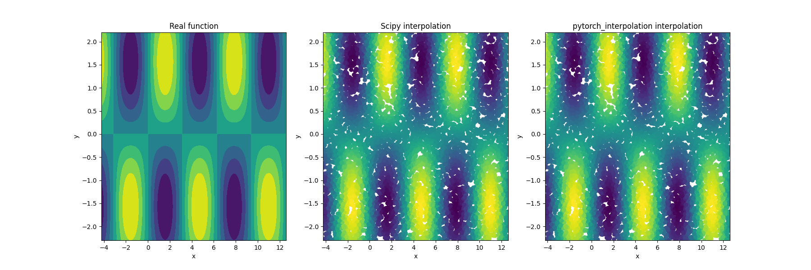
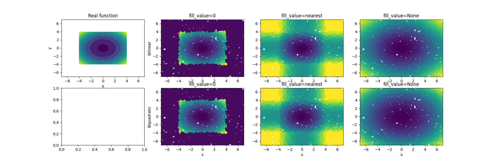
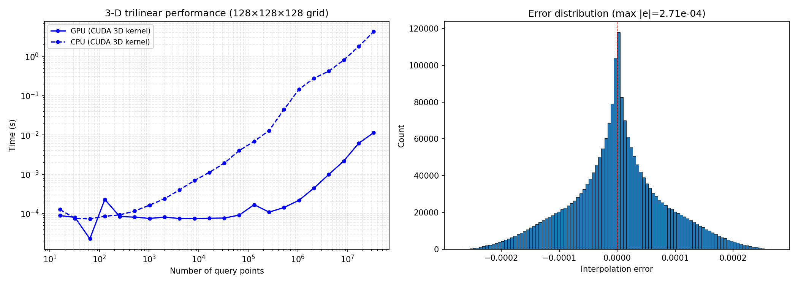
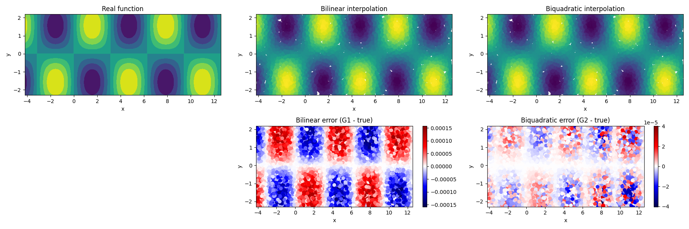
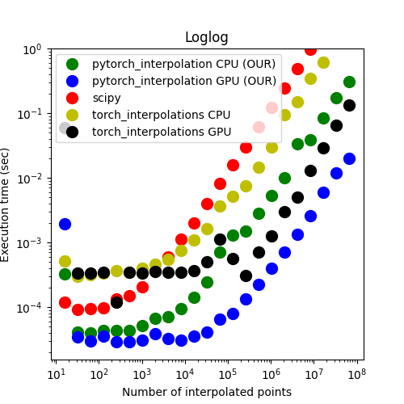

# pytorch_interpolation

Fast interpolation in PyTorch on regular grids for unstructured query points, analogous to Scipy's
[RegularGridInterpolator](https://docs.scipy.org/doc/scipy/reference/generated/scipy.interpolate.RegularGridInterpolator.html).

**Supported modes:**

| Dimensionality | Methods | Backend |
|---|---|---|
| **2-D** | Bilinear, Biquadratic | Custom C++/CUDA kernels |
| **2-D** | Bilinear | `torch.nn.functional.grid_sample` (no build required) |
| **3-D** | Trilinear | Custom C++/CUDA kernel (default), or `torch.nn.functional.grid_sample` |

The C++/CUDA backend significantly outperforms Scipy and other Python-based packages.
The `grid_sample`-backed interpolators work out of the box with any PyTorch installation — no compilation step needed.

Padding/linear/nearest extrapolation is applied to points outside the domain of the grid.
The methods assume the function is known on a regular (uniform) grid.

# Installation instructions

First, you need to have [PyTorch](https://pytorch.org/get-started) installed.

**Full install** (C++/CUDA kernels + grid_sample interpolators):
> `pip install --no-build-isolation .`

If you only need the `grid_sample`-backed interpolators (`RegularGridInterpolatorGridSample`, `RegularGridInterpolatorGridSample3D`), no C++/CUDA build is required — a plain `pip install .` is sufficient.

To run the examples provided, install numpy, scipy and matplotlib:
> `pip install numpy scipy matplotlib`

The repository was tested with Python 3.10 / 3.12 and PyTorch with CUDA version 12.4.


# Usage examples

The examples are in the `examples/` folder.

## 2-D interpolation

The package works similarly to Scipy's RegularGridInterpolator. In `example.py` we provide a simple example and comparison between our interpolation and Scipy's RegularGridInterpolator.

<p align="center">
  
</p>

The syntax is analogous to that of Scipy's RegularGridInterpolator.

Suppose that:

- `x` and `y` are 1-D tensors of grid coordinates (ascending order)
- `F` is the 2-D tensor of function values at these grid points, shape `(len(x), len(y))`
- `xpt` and `ypt` are tensors of query point coordinates
- `method=0` selects bilinear interpolation; `method=1` selects biquadratic

then you can call:

```python
from pytorch_interpolation import RegularGridInterpolator

interp = RegularGridInterpolator((x, y), F, method=0)
G = interp(xpt, ypt)
```

A `grid_sample`-backed variant (no C++/CUDA build required) with the same API is also available:

```python
from pytorch_interpolation import RegularGridInterpolatorGridSample

interp = RegularGridInterpolatorGridSample((x, y), F)
G = interp(xpt, ypt)
```

### Extrapolation

Optionally, the constant fill value padding can be modified as `fill_value=value`. Also, bilinear extrapolation is now possible by setting `fill_value=None` (just like in Scipy).
The default value is a constant zero-padding `fill_value=0.0`. If `fill_value="nearest"`, nearest-extrapolation is applied.

An example of the three extrapolation methods' usage is in `extrapolations.py`, which generates this figure:
<p align="center">
  
</p>

## 3-D trilinear interpolation


`RegularGridInterpolator3D` provides GPU-accelerated trilinear interpolation on 3-D regular grids using a custom C++/CUDA kernel (default). This is now the recommended backend for 3-D interpolation and is used in all main examples.

```python
from pytorch_interpolation import RegularGridInterpolator3D

# x, y, z: 1-D tensors of grid coordinates (ascending order)
# F: 3-D tensor of shape (len(x), len(y), len(z))
interp = RegularGridInterpolator3D((x, y, z), F, fill_value=0.0)
G = interp(xpt, ypt, zpt)
```

The legacy `RegularGridInterpolatorGridSample3D` is still available for compatibility and uses the 5-D path of `torch.nn.functional.grid_sample` (no custom build required).

The `fill_value` parameter behaves the same as in the 2-D case: `0.0` (default) for zero-padding, `"nearest"` for clamp/border extrapolation.

A full example is in `example_3d.py`, which benchmarks GPU vs CPU performance and measures accuracy against an analytic solution on a 128×128×128 grid:

<p align="center">
  
</p>

## Automatic backend selection


`RegularGridInterpolatorAutomatic` automatically selects the best backend based on the number of grid axes:

- **2 axes** → C++/CUDA kernel (`RegularGridInterpolator`, supports bilinear and biquadratic)
- **3 axes** → C++/CUDA kernel (`RegularGridInterpolator3D`, trilinear)

```python
from pytorch_interpolation import RegularGridInterpolatorAutomatic

# 2-D
interp_2d = RegularGridInterpolatorAutomatic((x, y), F_2d, method=0)
result = interp_2d(xpt, ypt)


# 3-D
interp_3d = RegularGridInterpolatorAutomatic((x, y, z), F_3d)
result = interp_3d(xpt, ypt, zpt)
```


# Error tests of bilinear vs biquadratic (2-D)
An example error test analysis can be generated by running `error_tests.py`, that generates the following figure:
<p align="center">
  
</p>


In this example the reported errors in L-$\infty$ (maximum norm) and L2 norms are:
Bilinear: max=1.579e-04, L2=6.371e-07 | Biquadratic: max=4.029e-05, L2=7.691e-08


# Performance
The script `performance.py` tests the performance for the 2-D C++/CUDA interpolator in CPU/CUDA vs Scipy and [torch_interpolations](https://github.com/sbarratt/torch_interpolations), another PyTorch package for bilinear interpolation written entirely in Python.
<p align="center">
  
</p>
Our implementation outperforms all other libraries. This is because we use precompiled C++/CUDA code that does not require type checking. In addition, our implementation allows for larger batch sizes than torch_interpolations in CUDA (we could test up to ≤ 2^29 query points, whereas torch_interpolations supported ≤ 2^27 query points).

The 3-D `grid_sample`-backed interpolator is benchmarked separately in `example_3d.py`.

All tests are done on an Intel(R) Core(TM) i9-14900 CPU and a NVIDIA GeForce RTX 4080 SUPER GPU. For the CPU performance tests, 8 threads are run in parallel in Torch.

# Python version tested
The package was tested with PyTorch CUDA 12.4 and Python 3.12. There seem to be issues with PyTorch CUDA 12.8 (similar to https://github.com/pytorch/pytorch/issues/149796).