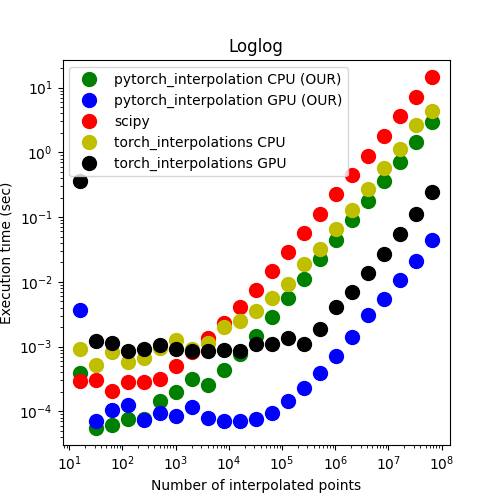

# pytorch_interpolation

Fast bilinear interpolation in PyTorch on a regular grid on a unstructured set of 2D query points, analogous to Scipy's 
[RegularGridInterpolator](https://docs.scipy.org/doc/scipy/reference/generated/scipy.interpolate.RegularGridInterpolator.html).

pytorch_interpolation runs entirely in C++/CUDA backends, thus significantly outperforming Scipy.

This repository implements a C++/CUDA extensions for PyTorch (in the style of https://github.com/pytorch/extension-cpp)

At present, only bilinear 2D interpolation is implemented and zero-padding is applied to points outside the domain of the cartesian grid.
The method assumes that the starting grid where the function to interpolate is known is a regular grid. 

# Installation intructions 

First, you need to have [PyTorch](https://pytorch.org/get-started) installed. 
Now you are set up and ready to install the repository
> `pip install .`

To run the examples provided, install numpy, scipy and matplotlib:
> `pip install numpy scipy matplotlib`

The repository was tested with Python3.8 and PyTorch with CUDA version 12.1


# Usage example
The package works similarly to Scipy's RegularGrid. In `example.py` we provided a simple example and comparison between our interpolation and Scipy's RegularGridInterpolator. 

<p align="center">
  
</p>

The syntax is analogous to that of Scipy's RegularGridInterpolator

In a nutshell, suppose that:

- `x` and `y` are the x and y grid of data points you want to interpolate over (given in ascending order)
- `F` is the function values at these points
- `xpt` and `ypt` be the N dimensional tensor of interpolation query points

then you can call

```

from pytorch_interp import RegularGridInterpolator

interp = RegularGridInterpolator(F,x,y,xpt,ypt)
G = interp(xpt,ypt)
```


# Performance
The script `performance.py` tests the performance test for pytorch_interp in cpu/cuda vs scipy and [torch_interpolations](https://github.com/sbarratt/torch_interpolations), another pytorch package for bilinear interpolation written entirely in Python.
<p align="center">
  
</p>
Our implementation outperformes all others libraries. This is because we use precompiled C++/CUDA code does not require type checking. In addition our implementation allow for larger batch sizes than torch_interpolations in CUDA (we could test up to <= 2^29 query points, whereas torch_interpolations supported <= 2^27 query points). 

All tests are done on a 11th Gen Intel(R) Core(TM) i7-11700 @ 2.50GHz CPU and a NVIDIA GeForce RTX 3060 GPU. For the CPU performance tests, 8 threads are run in parallel in Torch.