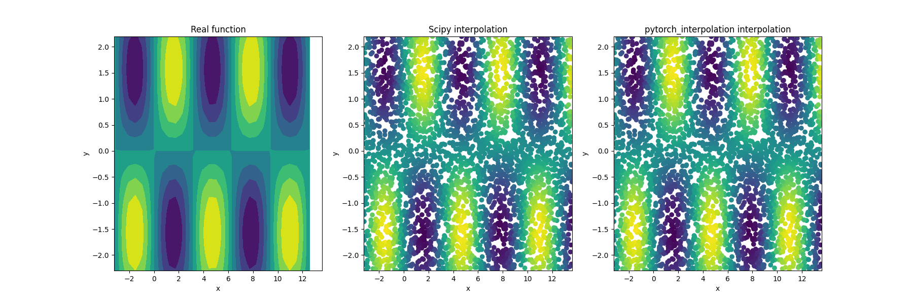

# pytorch_interpolation

PyTorch bilinear interpolation on a regular grid on a set of 2D query points,  to Scipy's 
[RegularGridInterpolator](https://docs.scipy.org/doc/scipy/reference/generated/scipy.interpolate.RegularGridInterpolator.html).

pytorch_interpolation runs entirely in C++/CUDA backends, thus significantly outperforming Scipy.

This repository implements a C++/CUDA extensions for PyTorch (in the style of https://github.com/pytorch/extension-cpp)


# Installation intructions 

First, you need to have [PyTorch](https://pytorch.org/get-started) installed. 
Now you are set up and ready to install the repository
> `pip install .`

To run the examples provided, install numpy, scipy and matplotlib:
> `pip install numpy scipy matplotlib`

The repository was tested with Python3.8 and PyTorch with CUDA version 12.1


# Usage example
The package works similarly to Scipy's RegularGrid. In `example.py` we provided a simple example and comparison between our interpolation and Scipy's RegularGridInterpolator. 

<p align="center">
  
</p>

In a nutshell, suppose that:

- `x` and `y` are the x and y grid of data points you want to interpolate over
- `F` is the function values at these points
- `xpt` and `ypt` be the N dimensional tensor of x and y interpolation query points

-> then `G = bilinear_interp(F,x,y,xpt,ypt)` the interpolated values at the desired locations

```

from pytorch_interp import bilinear_interp

... define x, y, F, xpt, ypt ...

G = bilinear_interp(F,x,y,xpt,ypt)

```


# Performance
The script `performance.py` tests the performance test for pytorch_interp in cpu/cuda vs scipy. 
<p align="center">
  
</p>
